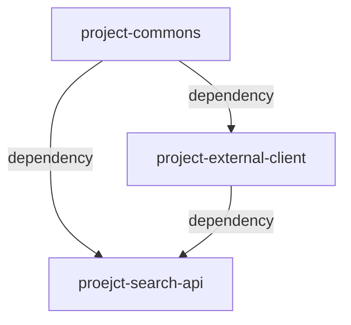

# 블로그 검색 서비스 
kakao 등의 open API를 활용하여 블로그 검색 및 인기검색어 조회 등의 기능을 개발합니다. 

## Getting Started
1. download jar: https://wo3okey.github.io/
2. swagger: http://localhost:8080/swagger-ui/index.html
3. h2 console: http://localhost:8080/h2-console

## Environment
    language
        kotlin: 1.7.22
        jdk: 17

    framework
        spring boot: 2.7.7
        spring data jpa: 2.7.7

    DB(in-memory), ORM
        h2: test db
        hibernate: 5.6.14
        querydsl: 5.0.0

    API document
        swagger: 4.17.1

## Modules
* project-commons: 공통 config, class 등 정의
* project-external-client: 외부 client 연계
* project-search-api: 검색 관련 rest api 개발

## API spec
| method | path                      | description           |
|--------|---------------------------|-----------------------|
| GET    | /v1/search/blogs          | 조건에 따른 블로그 검색(paging) |
| GET    | /v1/search/blogs/keywords | 조건에 따른 블로그 검색어 목록 조회  |

