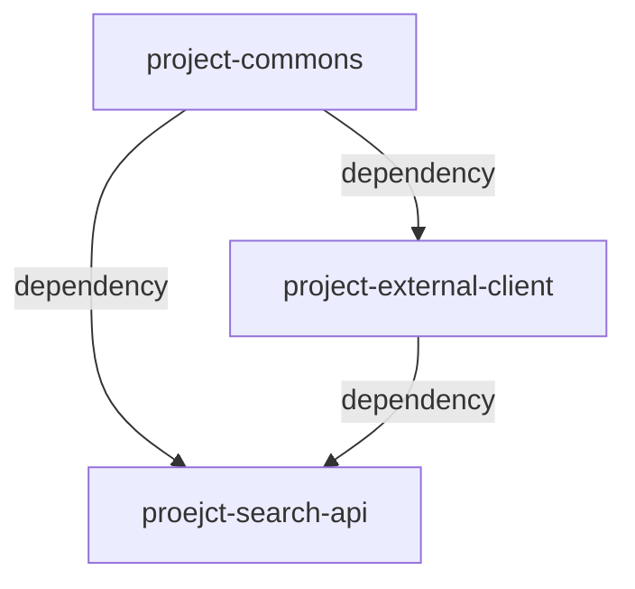

# 블로그 검색 서비스 
kakao 등의 open API를 활용하여 블로그 검색 및 검색어 조회 등의 기능을 개발합니다. 

## Getting Started
1. download jar: https://wo3okey.github.io/
2. cmd: java -jar downloaded.jar
3. swagger: http://localhost:8080/swagger-ui/index.html
4. h2 console: http://localhost:8080/h2-console
   - jdbc url: jdbc:h2:mem:searchdb
   - username: sa

## Environment
    language
        kotlin: 1.7.22
        jdk: 17

    framework
        spring boot: 2.7.7
        spring data jpa: 2.7.7

    DB(in-memory), ORM
        h2: test db
        hibernate: 5.6.14
        querydsl: 5.0.0

    API document
        swagger: 4.17.1

## Modules

* project-commons: 공통 config, class 등 정의
* project-external-client: 외부 client 연계
* project-search-api: 검색 관련 rest api 개발

## API spec
swagger: http://localhost:8080/swagger-ui/index.html

| method | path                      | description           | comment                                                                                    |
|--------|---------------------------|-----------------------|--------------------------------------------------------------------------------------------|
| GET    | /v1/search/blogs          | 조건에 따른 블로그 검색(paging) | kakao api 조회 후 결과가 없거나 이상이 있을 경우 naver api를 조회하며, 추가 될 client만 정의하면 검색 자체 로직은 수정할 필요 없습니다. |
| GET    | /v1/search/blogs/keywords | 조건에 따른 블로그 검색어 목록 조회 | top1~10을 인기순, 최신순으로 조회 가능합니다.                                                              |

## DB table spec
h2 console: http://localhost:8080/h2-console

#### BLOG_SEARCH_LOG
| column     | data_type | nullable | description   |
|------------|-----------|----------|---------------|
| id         | bigint    | n        | pk            |
| query      | text      | n        | 검색 query json |
| user_id    | bigint    | n        | 유저아이디         |
| created_at | datetime  | n        | 검색 로그 일시      |

#### BLOG_SEARCH_KEYWORD
| column       | data_type | nullable | description |
|--------------|----------|----------|-------------|
| id           | bigint   | n        | pk          |
| keyword      | varchar  | n        | 검색어         |
| search_count | int      | n        | 검색횟수        |
| created_at   | datetime | n        | 검색어 등록 일시   |
| modified_at  | datetime | n        | 검색어 변경 일시   |
* index
  * udx_keyword(keyword)
  * idx_search_count(search_count)
  * idx_modified_at(modified_at)